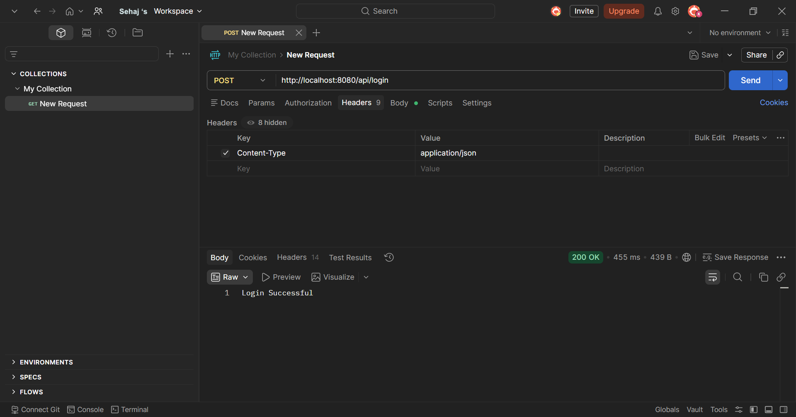
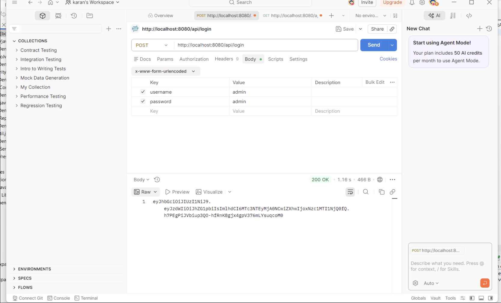
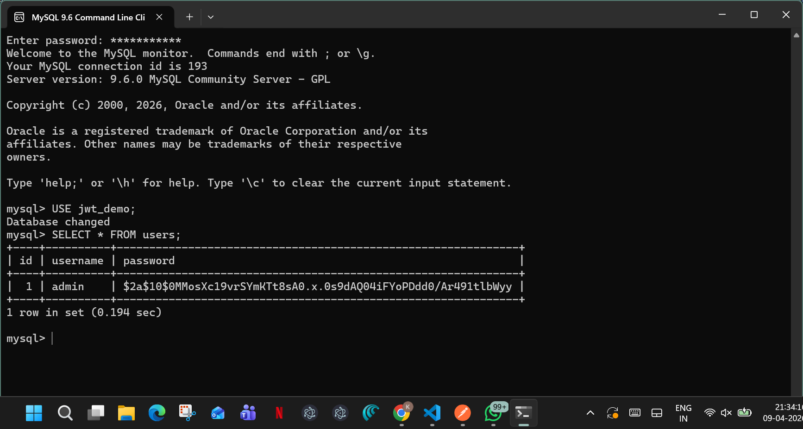

# FSD-EXP-9

Spring Boot JWT Authentication Project

## Overview
This project is a simple login system using Spring Boot and Spring Security.
It connects with MySQL database and verifies user credentials.

## Tech Stack
- Java
- Spring Boot
- Spring Security
- MySQL
- Postman

## Features
- User login authentication
- Password encryption using BCrypt
- Secure API
- Database connection

## API

POST /api/login

### Request (JSON)
{
  "username": "admin",
  "password": "admin123"
}

## Screenshots

## Run Project

mvn clean install -DskipTests
mvn spring-boot:run

## Author
Koyena Ghosh